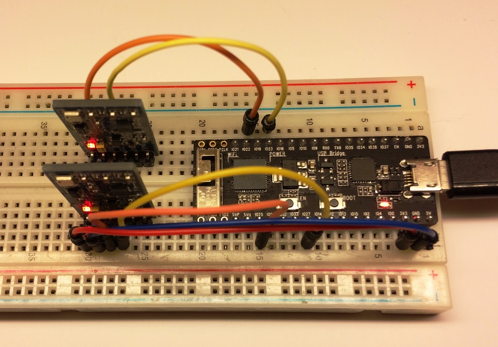

# bmp180-tests

Read [BMP180](https://www.bosch-sensortec.com/bst/products/all_products/bmp180) Barometric Pressure Sensor with [ESP32](https://espressif.com/en/products/hardware/esp32/overview), [esp-idf](https://github.com/espressif/esp-idf) and using:

* I2C h/w controller on board of ESP32
* software bit banging




## What this application does

The application reads in turns two BMP180 sensors, one using I2C peripheral and the other one using software bit banging (TWI - two wire interface). Measurement results obtained from the sensors are shown on serial terminal:

```
...
I (1223612) BMP180 TWI Read: Pressure : 99555 Pa, Altitude 148.8 m, Temperature : 21.7 oC
I (1224682) BMP180 I2C Read: Pressure : 99845 Pa, Altitude 124.4 m, Temperature : 22.3 oC
I (1224684) BMP180 TWI Read: Pressure : 99551 Pa, Altitude 148.9 m, Temperature : 21.7 oC
I (1225754) BMP180 I2C Read: Pressure : 99839 Pa, Altitude 123.8 m, Temperature : 22.3 oC
...
```

## Build Status

[](https://travis-ci.org/krzychb/bmp180-tests)


## Wiring of sensors

| Interface | SCL | SDA | Component Name |
| :--- | :---: | :---: | :---: |
| I2C | GPIO23 | GPIO22 | bmp180 |
| TWI | GPIO27 | GPIO25 | bmp180_twi |


## Contribute

Feel free to contribute to the project in any way you like!

If you find any issues with code or description please report them using *Issues* tab above.


## Credits

This repository has been prepared thanks to great work of the following teams and individuals:

* Espressif team that develops and maintains [esp-idf](https://github.com/espressif/esp-idf)  repository
* Software I2C library for ESP31B by Hristo Gochkov


## License

[Apache License Version 2.0, January 2004](LICENSE)